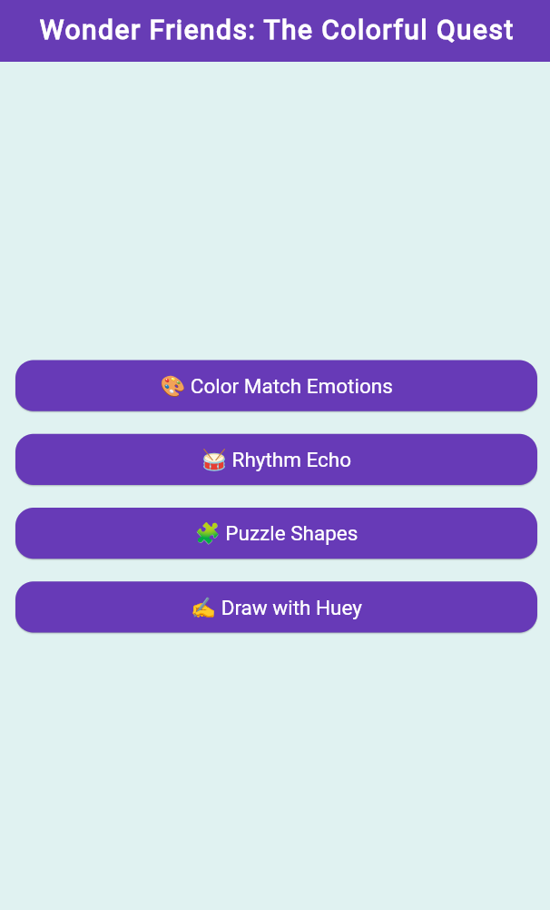
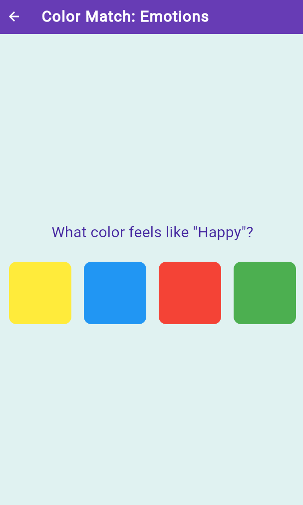

# Wonder Friends: The Colorful Quest

Welcome to **Wonder Friends: The Colorful Quest** – a vibrant, kid-friendly Flutter game collection designed to spark creativity, color recognition, rhythm, and logic in children!

## 🎮 Game Collection

- **🎨 Color Match Emotions**  
  Match emotions to their colors and learn about feelings in a fun, interactive way.

- **🥁 Rhythm Echo**  
  Listen to musical patterns and repeat them by tapping colorful notes.

- **🧩 Puzzle Shapes**  
  Drag and drop shapes to their matching slots, including circles, squares, and diamonds.

- **✍️ Draw with Huey**  
  Unleash your creativity by drawing with different colors.

## ✨ Features

- Bright, aesthetic, and unified color theme to engage children
- Simple, intuitive UI with large buttons and playful icons
- Progression system with unlockable levels and score tracking
- Responsive design for tablets and phones

## 🚀 Getting Started

### Prerequisites

- [Flutter](https://flutter.dev/docs/get-started/install) (3.x recommended)
- Dart SDK

### Installation

1. **Clone the repository:**
   ```
   git clone <your-repo-url>
   cd game_app
   ```

2. **Install dependencies:**
   ```
   flutter pub get
   ```

3. **Add assets:**
   - Place your audio files in `assets/notes/` (e.g., `C.mp3`, `D.mp3`, etc.)
   - Make sure your `pubspec.yaml` includes:
     ```yaml
     flutter:
       assets:
         - assets/notes/
     ```

4. **Run the app:**
   ```
   flutter run
   ```

## 🧩 Folder Structure

```
lib/
  main.dart
  colormatch.dart
  draw.dart
  rhythm.dart
  puzzle.dart
  level_progression.dart
  score_screen.dart
assets/
  notes/
    C.mp3
    D.mp3
    E.mp3
    F.mp3
```

## 🏆 Progression & Scoring

- Levels unlock as you complete games.
- Your score and avatar are saved and shown on the progress screen (tap the trophy icon in the app bar).

## 👦👧 For Kids

- All games use large, colorful buttons and simple instructions.
- No ads, no in-app purchases, and no data collection.

## 📱 Screenshots




## 📄 License

This project is for educational and non-commercial use.

---

Enjoy playing and learning with Wonder Friends! 🌈
